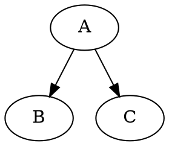
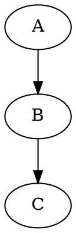
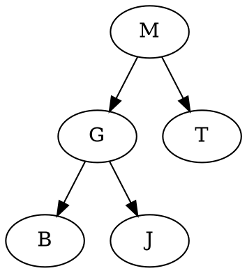

# Manual Técnico

## Reproductor de Música - Práctica 2

**Curso:** Introducción a la Programación y Computación 2  
**Lenguaje:** C#  
**Interfaz gráfica:** Windows Forms  
**Repositorio:** `GabrielSales123/IPC2_Practica2_202505058_2S2026`

---

## 1. Descripción del proyecto

El proyecto consiste en el desarrollo de un reproductor de música utilizando estructuras de datos dinámicas implementadas manualmente en C#.

El sistema permite cargar canciones desde un archivo JSON, almacenarlas en una cola de reproducción y organizarlas en un árbol binario de búsqueda. La interfaz gráfica permite interactuar con el reproductor y visualizar información relacionada con las estructuras de datos.

La práctica requiere utilizar una cola para administrar el orden de reproducción y un árbol binario de búsqueda para organizar y buscar canciones por título. También se utiliza Graphviz para representar visualmente las estructuras.

---

## 2. Tecnologías utilizadas

- C#

- .NET

- Windows Forms

- JSON

- Graphviz

- Visual Studio

- Git y GitHub

Windows Forms proporciona los formularios y controles necesarios para construir la interfaz gráfica de la aplicación. Microsoft documenta Windows Forms como un framework de interfaz gráfica para aplicaciones de escritorio de Windows basado en .NET. [Microsoft Learn - Windows Forms](https://learn.microsoft.com/es-es/dotnet/desktop/winforms/)

Graphviz se utiliza para representar gráficamente estructuras mediante el lenguaje DOT, que permite definir nodos, conexiones y atributos de los gráficos. [Graphviz - DOT Language](https://graphviz.org/doc/info/lang.html)

---

## 3. Requisitos del sistema

### Requisitos de software

- Windows.

- .NET instalado.

- Visual Studio o un entorno compatible con proyectos C#.

- Graphviz instalado y configurado.

- Git, si se desea clonar o administrar el repositorio.

### Requisitos del proyecto

El sistema debe:

1. Cargar las canciones desde un archivo JSON.

2. Construir la cola de reproducción.

3. Construir el árbol binario de búsqueda.

4. Permitir reproducir canciones.

5. Permitir buscar canciones.

6. Calcular el tiempo total de reproducción de la cola.

7. Mostrar información de las canciones.

8. Generar representaciones gráficas mediante Graphviz.

---

## 4. Estructura general del sistema

El funcionamiento general del programa puede representarse de la siguiente manera:

```text
                    Archivo JSON
                         |
                         v
                +----------------+
                | CancionService |
                +----------------+
                    /         \
                   /           \
                  v             v
          +------------+   +-------------+
          |    Cola    |   | Árbol BST   |
          +------------+   +-------------+
                  \             /
                   \           /
                    v         v
                  Windows Forms
                         |
                         v
                     Graphviz
```

El archivo JSON funciona como fuente inicial de información. Cada canción obtenida se utiliza para alimentar tanto la cola como el árbol binario.

---

## 5. Estructura de datos

### 5.1 Canción

La clase `Cancion` representa la información de una canción.

Cada objeto debe contener:

- Título.

- Artista.

- Género.

- Duración.

Ejemplo:

```csharp
public class Cancion
{
    public string Titulo { get; set; }
    public string Artista { get; set; }
    public string Genero { get; set; }
    public int Duracion { get; set; }
}
```

La duración se expresa en minutos.

---

## 6. Archivo JSON

Las canciones se cargan desde un archivo JSON ubicado dentro de la carpeta de datos del proyecto.

Una estructura válida es:

```json
[
  {
    "titulo": "Bohemian Rhapsody",
    "artista": "Queen",
    "genero": "Rock",
    "duracion": 6
  },
  {
    "titulo": "Blinding Lights",
    "artista": "The Weeknd",
    "genero": "Pop",
    "duracion": 3
  },
  {
    "titulo": "Take Five",
    "artista": "Dave Brubeck",
    "genero": "Jazz",
    "duracion": 5
  }
]
```

Los campos requeridos son:

| Campo      | Tipo   | Descripción                       |
| ---------- | ------ | --------------------------------- |
| `titulo`   | string | Nombre de la canción              |
| `artista`  | string | Artista que interpreta la canción |
| `genero`   | string | Género musical                    |
| `duracion` | int    | Duración en minutos               |

La práctica establece que la información inicial debe cargarse desde un archivo JSON estructurado y que cada canción debe contener estos cuatro campos.

---

## 7. Carga de canciones

La lectura del archivo puede realizarse utilizando `System.Text.Json`.

Ejemplo:

```csharp
string ruta = Path.Combine("Datos", "canciones.json");

string json = File.ReadAllText(ruta);

Cancion[] canciones =
    JsonSerializer.Deserialize<Cancion[]>(json);
```

El arreglo utilizado durante la lectura solamente sirve para obtener la información del archivo. La cola y el árbol deben continuar siendo estructuras implementadas manualmente.

---

## 8. Cola de reproducción

La cola administra el orden en que serán reproducidas las canciones.

La estructura sigue el principio:

```text
Primero en entrar
       |
       v
+---------+    +---------+    +---------+
| Canción | -> | Canción | -> | Canción |
+---------+    +---------+    +---------+
                                      |
                                      v
                                Última canción
```

La primera canción agregada es la primera canción que será reproducida.

### 8.1 Nodo de la cola

La cola puede utilizar una clase nodo:

```csharp
public class NodoCola
{
    public Cancion Cancion { get; set; }
    public NodoCola Siguiente { get; set; }

    public NodoCola(Cancion cancion)
    {
        Cancion = cancion;
        Siguiente = null;
    }
}
```

### 8.2 Operaciones principales

La cola debe implementar como mínimo:

- `Enqueue`: agregar una canción al final.

- `Dequeue`: extraer la primera canción.

- `Peek`: consultar la primera canción sin extraerla.

- `EstaVacia`: comprobar si no existen canciones.

- Cálculo del tiempo total de reproducción.

Ejemplo conceptual:

```text
Enqueue(A)
Enqueue(B)
Enqueue(C)

Cola:

A -> B -> C
^
|
Primera
```

Al reproducir:

```text
Dequeue()

B -> C
^
|
Nueva primera
```

No se deben utilizar estructuras como `Queue<T>` para implementar la cola, debido a las restricciones de la práctica.

---

## 9. Árbol binario de búsqueda

El árbol binario de búsqueda se utiliza para organizar y buscar canciones dentro de la biblioteca musical.

La clave utilizada para ordenar los nodos es el título de la canción.

Por ejemplo:

```text
              M
             / \
            G   T
           / \   \
          B   J   Z
```

Los títulos menores al nodo actual se almacenan a la izquierda y los títulos mayores a la derecha.

### 9.1 Nodo del árbol

Un nodo puede contener:

```csharp
public class NodoArbol
{
    public Cancion Cancion { get; set; }
    public NodoArbol Izquierdo { get; set; }
    public NodoArbol Derecho { get; set; }

    public NodoArbol(Cancion cancion)
    {
        Cancion = cancion;
        Izquierdo = null;
        Derecho = null;
    }
}
```

### 9.2 Inserción

Para insertar una canción se compara su título con el título almacenado en el nodo actual.

Conceptualmente:

```text
Si tituloNuevo < tituloActual
    -> ir a la izquierda

Si tituloNuevo > tituloActual
    -> ir a la derecha
```

En C# se puede realizar la comparación utilizando:

```csharp
tituloNuevo.CompareTo(tituloActual)
```

Esto permite determinar la relación alfabética entre ambos títulos.

---

## 10. Búsqueda de canciones

La búsqueda se realiza utilizando el árbol binario de búsqueda.

Ejemplo:

```text
                 M
                / \
               G   T
              / \
             B   J
```

Si se busca `J`:

```text
J vs M
J < M
Buscar izquierda

J vs G
J > G
Buscar derecha

J encontrado
```

Esto evita tener que revisar todos los elementos cuando la estructura está adecuadamente organizada.

---

## 11. Recorrido InOrder

El recorrido InOrder visita los nodos en el siguiente orden:

```text
Izquierda
Nodo
Derecha
```

Ejemplo:

```text
        M
       / \
      G   T
     / \
    B   J
```

El resultado del recorrido es:

```text
B
G
J
M
T
```

El recorrido InOrder es útil para obtener las canciones del árbol ordenadas alfabéticamente por título.

---

## 12. Reproducción de canciones

Cuando el usuario selecciona la opción de reproducir:

1. Se verifica si la cola está vacía.

2. Si está vacía, se muestra un mensaje indicando que no existen canciones pendientes.

3. Si contiene canciones, se extrae la primera canción.

4. Se muestran los datos de la canción reproducida.

5. Se actualiza la información de la cola.

6. Se actualiza la representación gráfica correspondiente.

Flujo:

```text
Reproducir
    |
    v
¿Cola vacía?
   / \
 Sí   No
 |     |
 v     v
Aviso  Dequeue
         |
         v
    Mostrar canción
         |
         v
    Actualizar cola
```

---

## 13. Tiempo total de reproducción

El sistema debe calcular el tiempo total estimado de reproducción de las canciones que permanecen en la cola.

El cálculo consiste en sumar las duraciones de todas las canciones pendientes.

Ejemplo:

```text
Canción 1 = 3 minutos
Canción 2 = 5 minutos
Canción 3 = 4 minutos

Total = 3 + 5 + 4
Total = 12 minutos
```

Los valores de duración promedio establecidos en el enunciado son:

| Género  | Duración promedio |
| ------- | ----------------- |
| Pop     | 3 minutos         |
| Rock    | 4 minutos         |
| Jazz    | 5 minutos         |
| Clásica | 8 minutos         |

La práctica especifica que el tiempo total debe considerar las canciones que se encuentran en espera dentro de la cola.

---

## 14. Windows Forms

La interfaz gráfica se desarrolla utilizando Windows Forms.

Windows Forms trabaja mediante formularios, controles y eventos. Las acciones realizadas por el usuario, como presionar botones, pueden generar eventos que ejecutan la lógica correspondiente.

La interfaz puede contener elementos como:

- Información de la canción actual.

- Barra de búsqueda.

- Botones de reproducción.

- Información de la cola.

- Tiempo total de reproducción.

- Resultados de búsqueda.

- Visualización del árbol.

- Visualización de la cola.

Ejemplo conceptual:

```text
+------------------------------------------------------+
|              REPRODUCTOR DE MÚSICA                  |
+------------------------------------------------------+
| Buscar canción: [____________________] [Buscar]      |
|                                                      |
| Canción actual                                       |
| Título: Bohemian Rhapsody                            |
| Artista: Queen                                       |
| Género: Rock                                         |
| Duración: 6 minutos                                  |
|                                                      |
| [Reproducir]                                         |
|                                                      |
| Cola de reproducción                                 |
| 1. Canción A                                         |
| 2. Canción B                                         |
| 3. Canción C                                         |
|                                                      |
| Tiempo restante: 14 minutos                          |
+------------------------------------------------------+
```

---

## 15. Eventos de la interfaz

Los botones de Windows Forms deben estar asociados con eventos.

Por ejemplo:

```csharp
private void btnReproducir_Click(object sender, EventArgs e)
{
    // Lógica para reproducir canción
}
```

La interfaz debe utilizar los eventos para comunicarse con las estructuras de datos.

El formulario no debería contener toda la lógica de la cola o del árbol. Es recomendable mantener las estructuras y servicios separados de la interfaz.

---

## 16. Organización recomendada del proyecto

Una organización posible es:

```text
Proyecto
|
+-- Datos
|   +-- canciones.json
|
+-- Modelos
|   +-- Cancion.cs
|
+-- Estructuras
|   +-- NodoCola.cs
|   +-- Cola.cs
|   +-- NodoArbol.cs
|   +-- ArbolBinario.cs
|
+-- Services
|   +-- CancionService.cs
|   +-- GraphvizService.cs
|
+-- Forms
|   +-- FormPrincipal.cs
|
+-- Resources
|
+-- Program.cs
|
+-- Proyecto.csproj
```

La estructura exacta puede variar dependiendo de la implementación utilizada en el repositorio.

---

## 17. Servicio de canciones

El servicio de canciones puede encargarse de:

- Leer `canciones.json`.

- Deserializar los datos.

- Crear los objetos `Cancion`.

- Insertar las canciones en la cola.

- Insertar las canciones en el árbol.

Flujo:

```text
canciones.json
      |
      v
CancionService
      |
      +------------+
      |            |
      v            v
    Cola        Árbol BST
```

De esta manera, la lectura del archivo queda separada de la interfaz gráfica.

---

## 18. Graphviz

Graphviz se utiliza para representar visualmente las estructuras de datos.

La representación se puede generar mediante el lenguaje DOT.

Un ejemplo básico de un árbol sería:



La estructura DOT permite definir nodos y conexiones entre ellos.

### 18.1 Representación de la cola

La cola puede representarse como:

```text
Canción A -> Canción B -> Canción C
```

En Graphviz, conceptualmente:



### 18.2 Representación del árbol

El árbol puede representarse indicando las relaciones entre los nodos:



Cada vez que cambie el estado de las estructuras, la representación gráfica puede actualizarse.

---

## 19. Actualización de Graphviz

La actualización de las gráficas debe realizarse después de operaciones importantes.

Por ejemplo:

```text
Agregar canción
      |
      v
Actualizar cola
      |
      v
Actualizar árbol
      |
      v
Generar DOT
      |
      v
Generar nueva imagen
      |
      v
Actualizar interfaz
```

Al reproducir una canción:

```text
Dequeue
   |
   v
Cambió la cola
   |
   v
Regenerar representación
```

Esto permite mantener la visualización sincronizada con las estructuras utilizadas por el programa.

---

## 20. Flujo de inicio de la aplicación

Al iniciar la aplicación se debe seguir un proceso similar al siguiente:

```text
Inicio
  |
  v
Inicializar estructuras
  |
  v
Leer canciones.json
  |
  v
Crear objetos Cancion
  |
  +----------------+
  |                |
  v                v
Insertar cola   Insertar árbol
  |                |
  +--------+-------+
           |
           v
     Inicializar UI
           |
           v
    Generar Graphviz
           |
           v
      Aplicación lista
```

La práctica establece que las canciones no se ingresan manualmente, sino que deben cargarse desde el archivo JSON al iniciar la aplicación.

---

## 21. Restricciones importantes

El proyecto debe cumplir las restricciones establecidas para la práctica.

No se deben utilizar estructuras nativas como:

```csharp
Queue<T>
List<T>
LinkedList<T>
```

para implementar la cola o el árbol.

Las estructuras deben ser desarrolladas manualmente mediante nodos y referencias.

La práctica establece específicamente que la cola de reproducción y el árbol binario deben ser implementados por el estudiante.

---

## 22. Manejo de errores

Se recomienda controlar situaciones como:

### Archivo JSON inexistente

```text
No se encontró el archivo canciones.json.
```

### JSON inválido

```text
No fue posible cargar las canciones.
```

### Cola vacía

```text
No hay canciones pendientes de reproducción.
```

### Canción no encontrada

```text
No se encontró la canción solicitada.
```

Los errores deben mostrarse mediante mensajes comprensibles para el usuario.

---

## 23. Pruebas funcionales

Antes de entregar el proyecto se recomienda comprobar:

### Carga inicial

- El archivo JSON existe.

- Las canciones se cargan correctamente.

- La cola contiene las canciones.

- El árbol contiene las canciones.

### Cola

- Se pueden agregar canciones.

- Se extrae primero la canción que ingresó primero.

- Se detecta correctamente una cola vacía.

- El tiempo total se actualiza.

### Árbol

- Las canciones se insertan correctamente.

- La comparación se realiza utilizando el título.

- Las búsquedas encuentran canciones existentes.

- Las búsquedas informan cuando una canción no existe.

### Graphviz

- La cola se representa correctamente.

- El árbol se representa correctamente.

- Las gráficas se actualizan después de modificar las estructuras.

### Interfaz

- Los botones ejecutan sus respectivas acciones.

- La información mostrada corresponde al estado actual.

- Los mensajes de error son comprensibles.

---

## 24. Ejemplo de flujo completo

Supongamos que el JSON contiene:

```text
Bohemian Rhapsody
Blinding Lights
Take Five
```

Al iniciar:

```text
JSON
 |
 +--> Cola
 |     Bohemian Rhapsody
 |     Blinding Lights
 |     Take Five
 |
 +--> Árbol
       ordenado por título
```

Si se presiona reproducir:

```text
Canción reproducida:
Bohemian Rhapsody
```

La cola queda:

```text
Blinding Lights
Take Five
```

El tiempo total se vuelve a calcular utilizando únicamente las canciones que continúan en espera.

El gráfico de la cola también debe actualizarse.

---

## 25. Compilación y ejecución

### Desde Visual Studio

1. Abrir la solución del proyecto.

2. Verificar que el archivo `canciones.json` se encuentre en la ubicación esperada.

3. Verificar las dependencias utilizadas por Graphviz.

4. Compilar el proyecto.

5. Ejecutar la aplicación.

En Visual Studio, una aplicación Windows Forms puede ejecutarse mediante el comando de inicio de depuración o la tecla `F5`.

### Desde terminal

Si el proyecto utiliza el SDK de .NET correspondiente:

```bash
dotnet build
```

Para ejecutar:

```bash
dotnet run
```

Los comandos disponibles pueden variar dependiendo del tipo de proyecto y de la versión de .NET utilizada.

---

## 26. Mantenimiento del código

Para facilitar futuras modificaciones se recomienda:

- Mantener separadas las clases de modelos.

- Mantener la cola y el árbol en clases independientes.

- Evitar colocar toda la lógica dentro del formulario.

- Mantener el archivo JSON separado del código.

- Utilizar nombres descriptivos.

- Crear métodos pequeños para cada operación.

- Actualizar Graphviz únicamente cuando cambie el estado de las estructuras.

- Evitar duplicar lógica.

---

## 27. Consideraciones para futuras modificaciones

La arquitectura permite agregar posteriormente funcionalidades como:

- Más canciones en el archivo JSON.

- Nuevos géneros.

- Mejoras visuales de la interfaz.

- Diferentes formas de búsqueda.

- Información adicional de las canciones.

- Mejoras en la visualización de Graphviz.

Estas modificaciones deben mantener la lógica principal de la cola y del árbol implementados manualmente.

---

## 28. Referencias

Microsoft. (2025). *Documentación de Windows Forms para .NET*. Microsoft Learn.  
[Documentación de Windows Forms para .NET | Microsoft Learn](https://learn.microsoft.com/es-es/dotnet/desktop/winforms/)

Microsoft. (2025). *Descripción general de Windows Forms*. Microsoft Learn.  
[Qué es Windows Forms - Windows Forms | Microsoft Learn](https://learn.microsoft.com/es-es/dotnet/desktop/winforms/overview/)

Graphviz. (s. f.). *DOT Language*.  
[DOT Language | Graphviz](https://graphviz.org/doc/info/lang.html)

Universidad de San Carlos de Guatemala, Facultad de Ingeniería. (2026). *Práctica 2: Reproductor de Música con Cola de Reproducción, Árboles Binarios y Windows Forms*.
